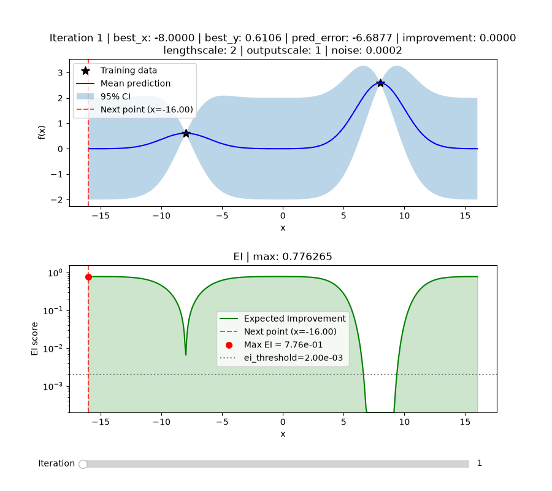

# actgpr

[](https://bestpractices.coreinfrastructure.org/projects/13772)
[](https://fair-software.eu)

**Active GPR (Gaussian Process Regression) Optimisation** is a Python package that finds the minimum of a scalar blackbox function by iteratively fitting a Gaussian Process surrogate and using Expected Improvement to pick the most informative next evaluation point.

The Gaussian Process surrogate is built on [GPyTorch](https://gpytorch.ai/); the Expected Improvement acquisition function follows [Jones, Schonlau & Welch (1998), *Efficient Global Optimization of Expensive Black-Box Functions*](https://doi.org/10.1023/A:1008306431147).

**Documentation:** [alxndrschroeder.github.io/actgpr](https://alxndrschroeder.github.io/actgpr/) gives the full API reference and a step by step tutorial, built from this repository's docstrings and reST sources with Sphinx.

## How it works

1. Evaluate the Objective at the initial input points.
2. Repeat:
   - Fit the Surrogate to all training data collected so far.
   - Maximise the Acquisition function (Expected Improvement) → choose the next input point.
   - Evaluate the Objective at that point.
3. Stop when the maximum EI score falls below `ei_threshold` (nothing left to gain) **or** the number of optimisation iterations reaches `max_iterations` (budget cap), whichever fires first.
4. Optionally, every run writes a complete reproducibility record (MRR, see below).

## Installation

Requires Python ≥ 3.13. Pick whichever ecosystem you already use.

> **Planned:** publishing `actgpr` to PyPI, so that installing becomes `pip install actgpr` and you can `import actgpr` from any project without cloning this repository. Until then, use one of the two paths below.

**With Poetry** (needs [Poetry](https://python-poetry.org/) ≥ 2.0, because the project uses the PEP 621 `pyproject.toml` format that Poetry 1.x cannot read). Versions are pinned in `poetry.lock`:

```bash
git clone https://github.com/AlxndrSchroeder/actgpr.git
cd actgpr
poetry install
```

**With conda** (needs [conda-lock](https://github.com/conda/conda-lock)). Versions are pinned in `conda-lock.yml`, solved separately for `linux-64`, `osx-64`, `osx-arm64`, and `win-64`:

```bash
git clone https://github.com/AlxndrSchroeder/actgpr.git
cd actgpr
conda-lock install --name actgpr conda-lock.yml
conda activate actgpr
pip install -e . --no-deps          # the package itself; deps come from the lock file
```

`environment.yml` holds the conda *ranges* (the input to conda-lock) and
`pyproject.toml` the Poetry ones; `conda-lock.yml` and `poetry.lock` hold
the respective *resolved* versions. Install from the lock files, not the
range files, for a reproducible environment.

## Quick start

The usage pattern:

1. **Give it an Objective.** Anything exposing `.evaluate(*x: float) -> tuple[float, ...]`. `ObjectiveFn(func)` wraps a plain function for you; for a real simulation it is usually more natural to write your own class with an `evaluate()` method instead, since `actgpr` never checks the type, only that the method exists.
2. **Configure the run.** Beyond the Objective and Surrogate you set `search_bounds` (the closed interval `[lo, hi]` in which the minimum is searched), `initial_train_x` (the points that seed the loop), `max_iterations` (budget cap), `ei_threshold` (early stopping threshold), `noise` (observation noise variance), and optionally `run_dir` (where to write the MRR record). See the parameter tables in the [tutorial](https://alxndrschroeder.github.io/actgpr/tutorial.html) for the full list.
3. **Execute** with `run()`, which returns `best_x` and `best_y` along with the full training data.
4. **Inspect** the run with `plot_iterations()`.

```python
from actgpr import ObjectiveFn, OptimisationRun, GPyTorchSurrogate


# 1. Your blackbox function. Here an analytic stand-in for the tutorial.
#    In practice it might run a simulation or trigger an experiment.
def my_blackbox(x: float) -> float:
    return (x - 1) ** 2


# 2. Wrap it in an Objective. ObjectiveFn(func) is a convenience for plain
#    functions like this one; a real simulation would instead be its own
#    class with an evaluate() method.
objective = ObjectiveFn(my_blackbox)

# 3. Configure and execute the optimisation run
run = OptimisationRun.with_training(
    objective=objective,            # the wrapped blackbox to minimise
    surrogate=GPyTorchSurrogate(),  # the GP model that approximates it
    search_bounds=(-3.0, 5.0),      # interval in which the minimum is searched
    initial_train_x=[-3.0, 5.0],    # points where we start looking for the minimum
    max_iterations=20,              # budget: max optimisation iterations
    ei_threshold=0.001,             # stop early once max EI drops below this
    noise=1e-4,                     # starting observation-noise variance
                                    # (tuned further during training)
    run_dir="results",              # optional: write the MRR record
)
result = run.run()
print(result["best_x"], result["best_y"])

# 4. Browse the surrogate iteration by iteration (EI axis is log-scaled
#    by default; pass log_scale=False for a linear one)
run.plot_iterations()
```

Expected output: `best_x` close to `1.0` and `best_y` close to `0.0` (the minimum of `(x − 1)²`). The result dict also contains `train_x`, `train_y`, `n_iterations`, and `stop_reason`.

`run.plot_iterations()` opens an interactive slider over the run: the GP fit
(top, with training data and 95% CI) and the EI landscape (bottom) that
picked each next point, converging on the minimum as EI shrinks.

### Example output

The animation below is **not** the quickstart example above. It shows a run on
`sin(x) + x²/40` over `[-16, 16]`, a harder objective whose several local
minima make the search behaviour easier to follow:



**Fit modes:** the two constructors select how GP hyperparameters are handled.

- `OptimisationRun.with_training(...)` re-tunes lengthscale, outputscale, and noise at every iteration using [Adam](https://arxiv.org/abs/1412.6980) (`torch.optim.Adam`), a gradient descent variant with momentum and per-parameter step sizes: over `training_iter` steps it adjusts the hyperparameters to maximise the marginal log likelihood, meaning how plausible the observed training data is under a GP with those hyperparameters. Adam only fits the surrogate; it never evaluates the blackbox. Use this mode when you do not know good hyperparameters, which is the usual case.
- `OptimisationRun.without_training(...)` keeps hyperparameters fixed at exactly the values you pass; nothing is tuned. Use this for controlled comparisons or when good values are already known:

```python
run = OptimisationRun.without_training(
    objective=objective,            # the wrapped blackbox to minimise
    surrogate=GPyTorchSurrogate(),  # the GP model that approximates it
    search_bounds=(-3.0, 5.0),      # interval in which the minimum is searched
    initial_train_x=[-3.0, 5.0],    # points where we start looking for the minimum
    max_iterations=20,              # budget: max optimisation iterations
    ei_threshold=0.001,             # stop early once max EI drops below this
    lengthscale=1.0,                # RBF kernel lengthscale (fixed)
    outputscale=1.0,                # kernel signal variance (fixed)
    noise=1e-4,                     # observation-noise variance (fixed)
)
result = run.run()
```

Every iteration's GP and EI state is kept by default (`store_snapshots=True`), so `run.plot_iterations()` can browse them afterwards. Pass `store_snapshots=False` to skip them, since they are the bulk of `results.h5`'s size. The `prediction_error`/`improvement` history used by `plot_run_history()` is recorded either way, regardless of this flag.

EI often shrinks by orders of magnitude as a run converges, enough to look like a flat line at zero on a linear axis. `plot_iterations()` therefore draws the EI axis on a log scale by default, with `ei_threshold` as a reference line so you can see the EI curve cross into converged territory. Pass `log_scale=False` for a linear axis.

## Run outputs (MRR)

When `run_dir` is given, each run creates a timestamped **run directory** (named from timestamp + key parameters) containing the five **MRR artifacts**:

| Artifact | Contents |
|---|---|
| `config.json` | All run parameters (written at start, so it survives crashes) |
| `manifest.json` | SHA-256 checksum of the inputs |
| `meta.json` | Environment: package name/version, repository, git commit, Python/library versions, platform, timestamps, output summary |
| `run.log` | Per-iteration audit trail, ending with a summary line giving `best_x`/`best_y` |
| `results.h5` | Self-describing HDF5 with all numerical results |

If the run raises partway through, `meta.json` and `results.h5` are still written as a best-effort checkpoint covering every iteration completed before the failure (`stop_reason="crashed"`), and `run.log` ends with an error line instead of the summary line.

`results.h5` layout:

```
/            attrs: run configuration
├── history/     per-iteration scalar series (iteration, next_point, new_y,
│                current_best, max_ei, prediction_error, improvement)
├── iterations/  iter_NNN/ GP snapshot arrays (omitted if store_snapshots=False)
└── final/       best_x, best_y, stop_reason, n_iterations + final train_x/train_y
                 + converged_max_ei/converged_next_point/converged_candidates/
                 converged_f_mean/converged_f_var/converged_ei_scores when the
                 run stopped via ei_threshold and snapshots were kept. This is
                 the GP/EI state of the fit that triggered convergence, whose
                 next_point was scored but never evaluated (so it has no
                 place in history/ or iterations/)
```

To visualise a past run, `plot_run_history(run_dir)` builds a plot of `prediction_error`, `improvement`, and `max_ei` vs. iteration straight from a run directory's `results.h5`, with no `OptimisationRun` object needed, so it works on any run you (or someone else) have on disk. As in `plot_iterations()`, `max_ei` is drawn on a log scale by default, on its own right-hand axis since it spans orders of magnitude while the other two are linear and signed. Pass `log_scale=False` to omit it:

```python
from actgpr.plotting import plot_run_history

plot_run_history("results/2026-07-20_212046_training50iter_ei0.001_maxiter20_n0.0002")
```

## Vocabulary

### The optimisation problem

| Term | Meaning |
|---|---|
| **Objective** | The real-valued scalar function being minimised: your blackbox, wrapped as anything exposing `.evaluate(*x) -> tuple[float, ...]` (e.g. `ObjectiveFn`, or your own class). Defaults to `f(x) = x²` (handy for tutorials and tests). |
| **Analytic objective** | An Objective computed by a mathematical formula (e.g. `x²`), used for development and testing. |
| **Experiment objective** | An Objective whose output comes from a real-world measurement or instrument. `ObjectiveFn(func, jitter=...)` simulates this on an analytic function by adding Gaussian sensor/measurement noise to each evaluation. |
| **`jitter`** | Standard deviation of the Gaussian noise `ObjectiveFn` optionally adds per evaluation, by default `0.0` (off). Not to be confused with **Cholesky jitter** below: same word, unrelated purpose, since this simulates experimental noise in the Objective while Cholesky jitter stabilises the GP's covariance matrix. If used, set the surrogate's `noise` to `jitter**2` (noise is a variance), otherwise the GP starts out assuming the data is far cleaner than it is. |
| **`train_x`** (or `x`) | The input points passed to the Objective. |
| **`train_y`** (or `y`) | The Objective outputs at those input points. |
| **`test_x`** | Input points where the surrogate predicts without evaluating the Objective. |
| **Training data** | The set of `(train_x, train_y)` pairs the GP model is fitted to. |
| **Search bounds** | The closed interval `[lo, hi]` within which input points are considered. |
| **`initial_train_x`** | The input points that seed the optimisation loop. |

### The surrogate (GP model)

| Term | Meaning |
|---|---|
| **Surrogate** | A Gaussian Process model fitted to all training data so far, used to predict the Objective cheaply at unevaluated points. |
| **`GPyTorchSurrogate`** | The surrogate backend wrapper (fitting + prediction) built on [GPyTorch](https://gpytorch.ai/); hides GPyTorch API details. |
| **`ExactGPModel`** | The GP model definition inside the wrapper: constant mean + scaled RBF kernel. |
| **Prior / posterior** | The GP distribution before / after conditioning on the training data. |
| **Likelihood** | The Gaussian noise model mapping latent function values to observed targets. |
| **Kernel (RBF)** | The covariance function: a radial-basis-function kernel wrapped in a scale kernel. |
| **`lengthscale`** | RBF kernel hyperparameter controlling how far correlations reach (smoothness). |
| **`outputscale`** | Kernel signal variance. |
| **`noise`** | Observation noise variance of the likelihood. Should match `jitter**2` if the Objective adds jitter (see above), since it is a variance, not a standard deviation. |
| **MLL** | Marginal log likelihood, the training objective maximised when fitting hyperparameters. |
| **Cholesky jitter** | Small value (`1e-4`) added to the covariance diagonal to keep it numerically positive definite; all computations use float64. |
| **`f_mean`** | Predicted posterior mean at given input points. |
| **`f_var`** | Predicted posterior variance (per-point uncertainty), shape `(m,)`. |
| **`f_covar`** | Full posterior covariance matrix, shape `(m, m)`. |
| **`f_preds`** | Predictive distribution of the latent function `f(test_x)`. |
| **`observed_pred`** | Predictive distribution of observed targets `y = f(x) + noise`. |
| **`f_samples`** | Samples drawn from the predictive posterior (only computed when `n_samples > 0`). |
| **`f_std`** | `sqrt(f_var)`, used inside EI and for the ±2σ (≈95 % CI) plot band. |

### The acquisition function

| Term | Meaning |
|---|---|
| **Acquisition function** | Scores candidate input points and selects the next input point to evaluate. |
| **Expected Improvement (EI)** | The closed-form acquisition score (Jones et al., 1998) balancing exploitation (confidently better mean) and exploration (high uncertainty). |
| **Candidates / `n_candidates`** | The evenly spaced grid of points within the search bounds that EI scores (default 500). "Candidates" refers only to this acquisition grid, never to training data. |
| **`ei_scores`** | The EI value of every candidate. |
| **`max_ei`** | The largest EI score in an iteration; compared against `ei_threshold` for convergence. |
| **`next_point`** | The next input point to evaluate. Found by taking the candidate grid's highest-EI point, then zoom-refining with a second, much finer grid confined to a small window around it, so `next_point` is not limited to the coarse grid's spacing and generally falls strictly between two candidates. |
| **Current best** | The smallest Objective value observed so far. |

### The optimisation loop

| Term | Meaning |
|---|---|
| **`OptimisationRun`** | Top-level orchestrator: owns the loop and all MRR writes. |
| **Fit mode** | `with_training` (hyperparameters optimised each iteration) vs. `without_training` (fixed); recorded as `"training"` / `"notraining"` in `config.json`. |
| **`max_iterations`** | Budget cap: the maximum number of active optimisation iterations (GPR fit cycles), not individual Objective calls. |
| **`ei_threshold`** | Convergence threshold: the loop stops when `max_ei` falls below it. |
| **Convergence criterion** | EI below threshold **or** budget reached, whichever fires first. |
| **`stop_reason`** | Which criterion fired: `"ei_threshold"` or `"max_iterations"`. |
| **`new_y`** | The Objective output at the newly evaluated `next_point`. |
| **`best_x` / `best_y`** | The input point with the lowest Objective output, and that output, which together are the final result. |
| **`store_snapshots`** | If `True` (the default), each iteration's full GP + EI state is also kept for interactive browsing via `plot_iterations()`. Set `False` to omit them and keep `results.h5` small. The `prediction_error`/`improvement` history used by `plot_run_history()` is recorded regardless of this flag. |
| **Deferred-write accumulator** | Per-iteration results are collected in memory during the run and written to `results.h5` once at the end. |

### Validation metrics

Computed every iteration and recorded in `run.log`, `results.h5` (`/history`), and the snapshot plot titles:

| Term | Meaning |
|---|---|
| **`prediction_error`** | `predicted_y − new_y`: the surrogate's signed error at the chosen point. |
| **`improvement`** | `max(0, current_best − new_y)`: the gain of this iteration's evaluation over the previous best. |

### Reproducibility (MRR)

| Term | Meaning |
|---|---|
| **MRR** | Minimal Reproducible Run, a pattern requiring every run to record: what was run, with what inputs, in which environment, what happened, and what came out. |
| **Run directory** | The timestamped folder under `run_dir` holding all MRR artifacts of a single run. |
| **Self-describing HDF5** | Configuration is stored as HDF5 attributes alongside the data, so `results.h5` can be understood without any other file. |
| **`plot_run_history()`** | Builds the `prediction_error`/`improvement`/`max_ei` plot from a run directory's `results.h5` alone, with no `OptimisationRun` object needed. |

## Development

```bash
poetry run pytest tests/            # all tiers: unit, integration, regression
poetry run black src/ tests/        # format
poetry run ruff check src/ tests/   # lint
poetry run sphinx-build -W docs docs/build/html   # API docs (warnings = errors)
```

The regression tier compares a fixed-seed run against `tests/regression/data/quadratic_baseline.csv`; the test module documents how to regenerate the baseline after an intentional behaviour change.

Pushing to `main` rebuilds and republishes the docs above via GitHub Pages (see `.github/workflows/ci.yml`), so the local `sphinx-build` command is for previewing changes before they merge.

## Contributing

Bug reports, enhancement requests, and pull requests are welcome. See
[CONTRIBUTING.md](CONTRIBUTING.md) for how to report issues, the branch/PR
workflow, and the coding standards CI enforces.

## Security

Found a vulnerability? See [SECURITY.md](SECURITY.md) for how to report it privately.

## License

MIT, see [LICENSE](LICENSE).
