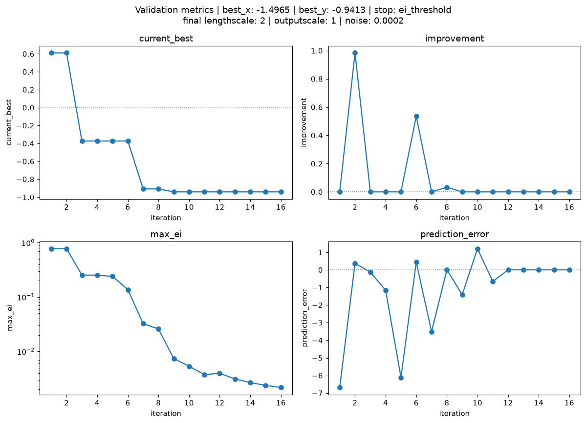

Tutorial
========

This tutorial walks through a complete optimisation run: wrapping a blackbox
function in an Objective, configuring the search, executing the run, and
reading the reproducibility record it leaves behind.

Setup
-----

.. code-block:: bash

   git clone https://github.com/AlxndrSchroeder/actgpr.git
   cd actgpr
   poetry install

Step 1: give it an Objective
------------------------------

``actgpr`` minimises anything exposing ``evaluate(*x: float) -> tuple[float,
...]``. It never checks whether that object is a particular type, only
that the method exists (duck typing). Which of the two ways below to use
depends on what you're wrapping.

Wrapping a plain function
~~~~~~~~~~~~~~~~~~~~~~~~~~

Use ``ObjectiveFn``, a convenience that turns any
``Callable[[float], float]`` into an Objective. This is the right choice
when your blackbox is already a simple function:

.. code-block:: python

   from actgpr import ObjectiveFn

   def my_blackbox(x: float) -> float:
       """Stand-in for a simulation or experiment."""
       return (x - 1) ** 2

   objective = ObjectiveFn(my_blackbox)

``objective.evaluate`` accepts one or more input points and returns a tuple
of outputs:

.. code-block:: python

   objective.evaluate(0.0)        # (1.0,)
   objective.evaluate(0.0, 3.0)   # (1.0, 4.0)

Errors raised inside your function propagate unchanged, so you can handle
them by their original type.

Simulating experimental noise
~~~~~~~~~~~~~~~~~~~~~~~~~~~~~~

A real experiment's readings are noisy, while an analytic stand-in like
``my_blackbox`` above is not. Pass ``jitter`` to add independent Gaussian
noise to each evaluation, simulating that sensor/measurement noise:

.. code-block:: python

   noisy_objective = ObjectiveFn(my_blackbox, jitter=0.1)

If you use jitter, set the surrogate's ``noise`` (Step 2) to match.
``jitter`` is a standard deviation, ``noise`` is a variance, so pass
``noise=jitter**2``:

.. code-block:: python

   run = OptimisationRun.with_training(
       objective=noisy_objective,
       surrogate=GPyTorchSurrogate(),
       search_bounds=(-3.0, 5.0),
       initial_train_x=[-3.0, 5.0],
       max_iterations=20,
       ei_threshold=0.001,
       noise=0.1**2,   # matches noisy_objective's jitter=0.1
   )

Without this, the GP starts out assuming ``noise``'s default of near-zero
observation noise (``1e-4``) and will overfit to what is actually random
jitter, mistaking noise for real structure in the objective.
``with_training`` still tunes ``noise`` further from there, so passing a
realistic starting value just gets it started in the right place.

The jitter noise comes from a generator the ``ObjectiveFn`` owns, seeded
with 25 by default, so a jittered run reproduces without you seeding
anything and the noise does not disturb the global ``torch`` RNG. Pass a
different ``seed`` for a different noise sequence:

.. code-block:: python

   ObjectiveFn(my_blackbox, jitter=0.1, seed=7)

Wrapping your own simulation
~~~~~~~~~~~~~~~~~~~~~~~~~~~~~

If you already have a simulation or experiment of your own, meaning not
just a bare function but something with setup, configuration, or state
involved, write your own class with an ``evaluate()`` method instead of
reaching for ``ObjectiveFn``. This is the more natural fit for anything
beyond a single pure function call, and it requires no base class or
registration:

.. code-block:: python

   class MySimulation:
       """Wraps an existing simulation as an actgpr Objective."""

       def __init__(self, config):
           self.config = config  # e.g. simulation setup, fixed parameters

       def evaluate(self, *x: float) -> tuple[float, ...]:
           return tuple(self._run_simulation(v) for v in x)

       def _run_simulation(self, x: float) -> float:
           ...  # launch your simulation/experiment at input x, return its output

   objective = MySimulation(config=...)

``OptimisationRun`` only ever calls ``objective.evaluate(...)``. It never
checks whether ``objective`` is an ``ObjectiveFn``, so a class like this
one works exactly the same way.

Step 2: configure the run
--------------------------

Three decisions matter most:

``search_bounds``
    The closed interval ``[lo, hi]`` in which the algorithm searches for the
    minimum. The blackbox is never evaluated outside it.

``max_iterations``
    The budget cap: the maximum number of active optimisation iterations
    (GPR fit cycles).

``ei_threshold``
    The convergence threshold: the run stops early once the best achievable
    Expected Improvement falls below this value, meaning the surrogate sees
    nothing left to gain.

You also choose a **fit mode**:

- ``OptimisationRun.with_training(...)`` re-tunes the GP hyperparameters
  (lengthscale, outputscale, noise) at every iteration using
  `Adam <https://arxiv.org/abs/1412.6980>`_ (GPyTorch's ``torch.optim.Adam``
  integration), a gradient-descent variant that maximises the marginal log
  likelihood, meaning how plausible the observed training data is under the
  GP. Use this when you do not know good hyperparameters, which is the
  usual case.
- ``OptimisationRun.without_training(...)`` keeps hyperparameters fixed at
  the values you pass. Use this for controlled comparisons or when good
  values are already known.

.. code-block:: python

   from actgpr import GPyTorchSurrogate, OptimisationRun

   run = OptimisationRun.with_training(
       objective=objective,
       surrogate=GPyTorchSurrogate(),
       search_bounds=(-3.0, 5.0),   # interval in which the minimum is searched
       initial_train_x=[-3.0, 5.0],  # points where we start looking for the minimum
       max_iterations=20,
       ei_threshold=0.001,
       run_dir="results",            # write the MRR record
   )

Step 3: execute and interpret
------------------------------

.. code-block:: python

   result = run.run()

   print(result["best_x"])       # ≈ 1.0  (input point with the lowest output)
   print(result["best_y"])       # ≈ 0.0  (the lowest output found)
   print(result["n_iterations"])  # iterations actually executed
   print(result["stop_reason"])   # "ei_threshold" or "max_iterations"

``result["train_x"]`` and ``result["train_y"]`` hold every input point the
run evaluated and the corresponding Objective outputs: the initial points
first, then one point per iteration.

Step 4: browse the iterations
------------------------------

Per-iteration state is kept by default (``store_snapshots=True``), so you
can step through the surrogate's view of the problem iteration by
iteration:

.. code-block:: python

   run.plot_iterations()

An interactive matplotlib window opens with the GP prediction (mean, 95 %
confidence band, training data) on top, the EI landscape below, and a
slider to scrub through iterations.

EI typically shrinks by orders of magnitude as a run converges, so on a
linear axis later iterations would look like a flat line at zero with no
visible structure. The EI axis is therefore drawn on a log scale by
default, with ``ei_threshold`` as a reference line. Pass ``log_scale=False``
for a linear axis:

.. code-block:: python

   run.plot_iterations(log_scale=False)

If the run stopped because ``max_ei`` fell below ``ei_threshold``, the
slider's final frame is the fit that triggered that convergence, titled
"(converged, not evaluated)" since its candidate point was scored but
never actually evaluated, so it carries no ``pred_error``/``improvement``.

Each title's second line reports the hyperparameters of that iteration's
fit. Under ``without_training`` they stay constant; under
``with_training`` they change every iteration, since Adam retunes them.

A harder example
~~~~~~~~~~~~~~~~~

``(x - 1)**2`` has a single minimum, so the search has little to explore.
This configuration uses a multi-modal objective, where the surrogate has to
distinguish several local minima:

.. code-block:: python

   import math

   from actgpr import ObjectiveFn, OptimisationRun, GPyTorchSurrogate

   objective = ObjectiveFn(lambda x: math.sin(x) + (x**2) / 40)

   run = OptimisationRun.without_training(
       objective=objective,
       surrogate=GPyTorchSurrogate(),
       search_bounds=(-16.0, 16.0),
       initial_train_x=[-8.0, 8.0],
       max_iterations=20,
       ei_threshold=0.002,
       n_candidates=500,
       lengthscale=2.0,
       outputscale=1.0,
       noise=2e-4,
   )
   run.run()
   run.plot_iterations()

Stepping the slider through that run looks like this:

.. image:: ../assets/plot_iterations_demo.gif
   :alt: Per-iteration GP fit and EI landscape for sin(x) + x^2/40, converging on the minimum
   :width: 600

The blue band is the GP's 95 % confidence interval. It is wide wherever the
objective has not been evaluated and pinches shut around each training
point, so watching it narrow around ``x = -1.5`` is watching the surrogate
become certain. Below it, the EI curve peaks where the next evaluation is
most worth spending, and collapses towards ``ei_threshold`` as that
certainty grows.

It converges after 17 iterations via ``ei_threshold``, at
``best_x = -1.4965``, ``best_y = -0.9413``. The true minimum sits at
``x = -1.49593``, so the run lands within ``5.5e-4`` of it after only 18
objective evaluations: the 2 initial points plus one per evaluated
iteration. The 17th iteration triggered convergence and was never
evaluated.

Fixed hyperparameters (``without_training``) are why each title's second
line stays constant across the frames; ``with_training`` would show them
retuned every iteration.

Step 5: check that it converged
--------------------------------

The slider shows what the surrogate believed at each step. The metrics
figure shows whether the run as a whole got anywhere:

.. code-block:: python

   run.plot_metrics()

Four panels, one per metric, for the same run as the animation above:

``current_best``
    The lowest objective value found so far. It steps down and then
    flattens, which is the run finding the minimum and then confirming it.

``improvement``
    How much each evaluation lowered ``current_best``. It spikes early,
    then sits at zero once the optimiser is refining rather than
    discovering. Flat ``improvement`` while ``max_ei`` is still high means
    the search is exploring, not finished.

``max_ei``
    The convergence signal, on a log axis. It falls by three orders of
    magnitude and the run stops when it crosses ``ei_threshold``. A run
    that has not converged shows this line still comfortably above the
    threshold.

``prediction_error``
    ``predicted_y - new_y``: how wrong the surrogate was about the point it
    just chose. Large and swinging either side of zero early on, then
    settling towards zero as the surrogate learns the objective.

One panel per metric rather than one shared axes: the four have unrelated
units and ranges, so overlaying them flattens all but the largest into a
line along zero. ``max_ei`` is the only one that can take a log axis, since
``prediction_error`` is signed and ``improvement`` is frequently exactly
zero. Pass ``log_scale=False`` to make that panel linear too.

Step 6: the reproducibility record (MRR)
-----------------------------------------

Because ``run_dir`` was given, the run created a timestamped folder under
``results/`` holding the five MRR artifacts:

- ``config.json``: every parameter used, written at the start of the run
- ``manifest.json``: a SHA-256 checksum of the inputs
- ``meta.json``: environment, covering package name, version, and
  repository, git commit, Python/library versions, platform, timestamps,
  and output summary
- ``run.log``: a human-readable, per-iteration audit trail, ending with a
  summary line giving ``best_x``/``best_y``. That line is the quickest way
  to read off the identified minimum without opening ``results.h5`` or
  inspecting the ``run.run()`` return value
- ``results.h5``: self-describing HDF5, where configuration is stored as
  attributes alongside the data, so the file can be understood on its own

To browse ``results.h5`` without writing code, the
`H5Web <https://marketplace.visualstudio.com/items?itemName=h5web.vscode-h5web>`_
VS Code extension opens HDF5 files directly in the editor, showing groups,
attributes, and plots of any dataset.

If the run raises partway through, ``meta.json`` and ``results.h5`` are
still written as a best-effort checkpoint covering every iteration completed
before the failure (``stop_reason="crashed"``), and ``run.log`` ends with
an error line instead of the summary line.

Revisiting a saved run
~~~~~~~~~~~~~~~~~~~~~~~

Both figures can be rebuilt from a run directory alone, with no
``OptimisationRun`` object, so a past run can be revisited at any later
time. ``load_metrics`` draws the validation metrics:

.. code-block:: python

   from pathlib import Path

   from actgpr.plotting import load_metrics

   run_dir = sorted(Path("results").iterdir())[-1]   # newest run
   load_metrics(run_dir)

and ``load_iterations`` opens the same interactive slider as
``run.plot_iterations()``:

.. code-block:: python

   from actgpr.plotting import load_iterations

   slider = load_iterations(run_dir)

Assign the slider to a variable that outlives the call. Matplotlib keeps
only a weak reference to it, so a slider left unassigned is garbage
collected: it is still drawn, but silently stops responding to drags.

The slider needs the run to have kept snapshots (the default). It raises
``RuntimeError`` for a run executed with ``store_snapshots=False``, since
the per-iteration GP arrays were never written. ``load_metrics`` works
either way, since the validation metrics are always recorded.

For a custom analysis, read the same series directly:

.. code-block:: python

   import h5py

   with h5py.File(run_dir / "results.h5") as f:
       iteration = f["history/iteration"][:]
       prediction_error = f["history/prediction_error"][:]
       improvement = f["history/improvement"][:]

Parameter reference
--------------------

``with_training`` and ``without_training`` share the same core parameters
and differ only in how the GP hyperparameters are handled.

Shared parameters
~~~~~~~~~~~~~~~~~~

.. list-table::
   :header-rows: 1
   :widths: 20 80

   * - Parameter
     - Meaning
   * - ``objective``
     - The wrapped blackbox function to minimise (an ``ObjectiveFn``).
   * - ``surrogate``
     - The GP surrogate backend. Pass a fresh ``GPyTorchSurrogate()``, since
       it holds fitted state internally, so do not reuse one across runs.
   * - ``search_bounds``
     - The closed interval ``(lo, hi)`` in which the algorithm searches for
       the minimum. The blackbox is never evaluated outside it.
   * - ``initial_train_x``
     - Points where the search starts. The first surrogate is fitted to
       these before the loop runs. By convention, use the two
       ``search_bounds`` endpoints.
   * - ``max_iterations``
     - Budget cap: the maximum number of active optimisation iterations
       (GPR fit cycles), not individual blackbox evaluations.
   * - ``ei_threshold``
     - Convergence threshold: the run stops early once the best achievable
       Expected Improvement drops below this value.
   * - ``n_candidates`` (default 500)
     - Number of evenly spaced candidate points the acquisition function
       scores every iteration.
   * - ``noise`` (default 1e-4)
     - Starting observation noise variance for the GP likelihood. In
       ``with_training`` it is only a *starting point*, since Adam tunes it
       further alongside lengthscale and outputscale. In
       ``without_training`` it stays fixed at this value for the whole run.
   * - ``store_snapshots`` (default True)
     - Keeps each iteration's full GP/EI arrays (in memory and under
       ``results.h5``'s ``iterations/`` group) so ``plot_iterations()`` can
       browse them afterward. Set ``False`` to omit them, since they are the
       bulk of ``results.h5``'s size. The
       ``prediction_error``/``improvement`` history used by
       ``load_metrics()`` is recorded either way.
   * - ``run_dir`` (default None)
     - If given, writes the MRR record (see Step 6) to a timestamped
       folder under this path. If ``None``, nothing is written to disk.

``with_training`` only
~~~~~~~~~~~~~~~~~~~~~~~

.. list-table::
   :header-rows: 1
   :widths: 20 80

   * - Parameter
     - Meaning
   * - ``training_iter`` (default 50)
     - Number of Adam optimisation steps run per surrogate fit, tuning
       lengthscale, outputscale, and noise to maximise the marginal log
       likelihood.

``without_training`` only
~~~~~~~~~~~~~~~~~~~~~~~~~~

.. list-table::
   :header-rows: 1
   :widths: 20 80

   * - Parameter
     - Meaning
   * - ``lengthscale`` (default 1.0)
     - Fixed RBF kernel lengthscale, never tuned.
   * - ``outputscale`` (default 1.0)
     - Fixed kernel signal variance, never tuned.

Plotting reference
------------------

Two figures, each reachable two ways. That is four entry points in total,
and there is nothing else to learn.

The prefix says where the data comes from. ``plot_`` draws from the run
object you are still holding, so those two are methods on
``OptimisationRun``. ``load_`` takes the path to a run's log directory,
reads its ``results.h5``, and draws the same figure, so those two are
functions imported from ``actgpr.plotting``.

.. list-table::
   :header-rows: 1
   :widths: 30 35 35

   * -
     - The surrogate itself
     - Validation metrics
   * - From the run
     - ``run.plot_iterations()``
     - ``run.plot_metrics()``
   * - From the logs
     - ``load_iterations(run_dir)``
     - ``load_metrics(run_dir)``

The bottom row needs ``run_dir`` to have been set, since it reads
``results.h5``; the methods work either way. ``run.run_dir`` holds the
timestamped directory the run wrote to, so the two functions also work on a
run you just finished, not only on one from last month.

.. list-table::
   :header-rows: 1
   :widths: 38 62

   * - Use
     - What it draws
   * - ``run.plot_iterations()``
     - **Start here.** An interactive slider over every iteration of a
       finished run: the GP fit on top, the EI landscape below. Watching the
       band narrow around the minimum is the clearest picture of what the
       algorithm did.
   * - ``run.plot_metrics()``
     - The whole run as one figure, four panels: ``current_best``,
       ``improvement``, ``max_ei`` (log-scaled), and ``prediction_error``
       against iteration. Use it to judge convergence at a glance.
   * - ``load_iterations(run_dir)``
     - The slider again, read back from a run's logs. Keep the returned
       ``Slider`` in a variable or matplotlib will collect it and it will
       stop responding.
   * - ``load_metrics(run_dir)``
     - The four panels again, read back from a run's logs.

Each pair draws the identical figure, so which one to reach for depends
solely on what you still have to hand.

All four take ``show=False``. Use it whenever you open more than one
figure: ``plt.show()`` displays *every* open figure, not just the newest,
so calling it once per figure re-displays the earlier ones, and the first
window flickers back into view as the last one is closed. Build the figures
first, then call ``plt.show()`` yourself:

.. code-block:: python

   import matplotlib.pyplot as plt

   slider = load_iterations(run_dir, show=False)
   load_metrics(run_dir, show=False)

   plt.show()   # once, for both

All four also take ``log_scale=False``: on the slider it makes the EI panel
linear, on the metrics figure it makes the ``max_ei`` panel linear. Log is the default
because EI falls by orders of magnitude as a run converges, so on a linear
axis it sits flat against zero and its decay towards ``ei_threshold`` is
invisible. The other three metrics stay linear either way, since
``prediction_error`` is signed and ``improvement`` is frequently exactly
zero, neither of which a log axis can display.

Where to go next
----------------

- The :doc:`API reference <api/actgpr>` documents every class and function.
- The README's vocabulary section defines every term used in this package.
